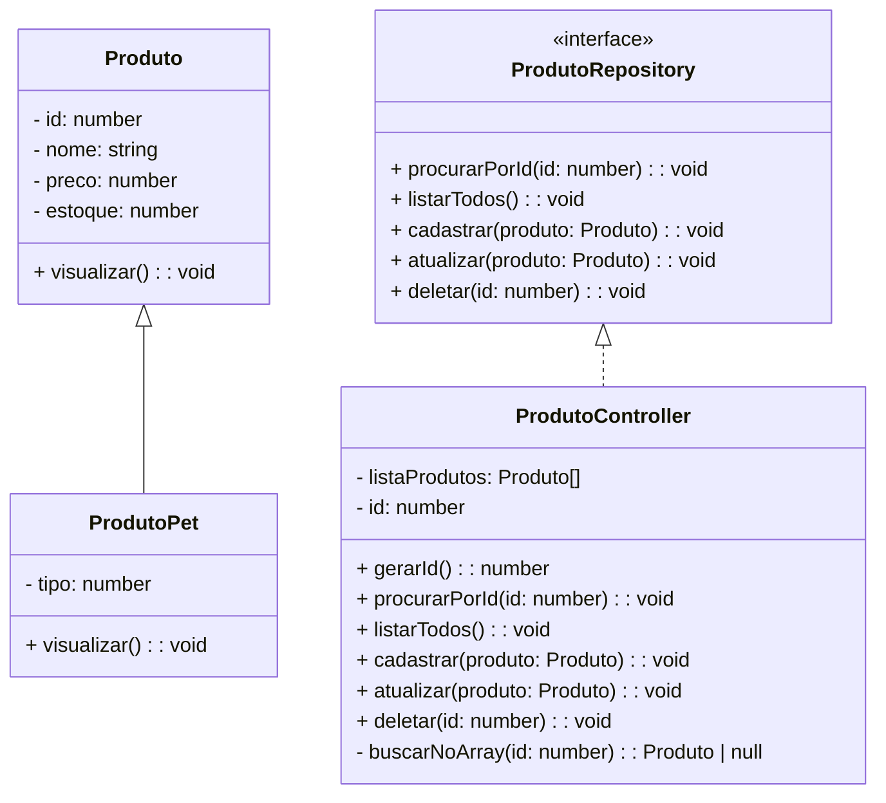

# 🐶 Sistema de Controle de Estoque – PetShop

Projeto desenvolvido em **TypeScript** como parte de avaliação prática do Bloco 1 da Generation Brasil.

O objetivo é criar um sistema de controle de estoque para uma loja PetShop, utilizando Programação Orientada a Objetos (POO), interface, controller com array interno e um menu interativo no terminal.

---

---

## ▶ Como executar o projeto

### 1. Instalar dependências

### 2. Compilar o código TypeScript

### 3. Executar o sistema

---

## Desenvolvido por Jéssica Gizela

Projeto criado para treinamento em:

POO

Estruturas de dados

Arquitetura em camadas

CRUD

TypeScript e Node.js

